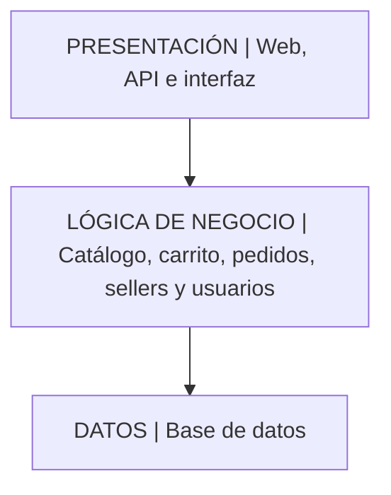

# Arquitectura inicial del sistema

## Ejercicio 09: Diseñar la arquitectura en capas

| Capa | Pregunta que responde |
|---|---|
| Presentación | ¿Cómo interactúa el usuario? |
| Lógica de negocio | ¿Qué hace el sistema? |
| Datos | ¿Dónde se almacena la información? |