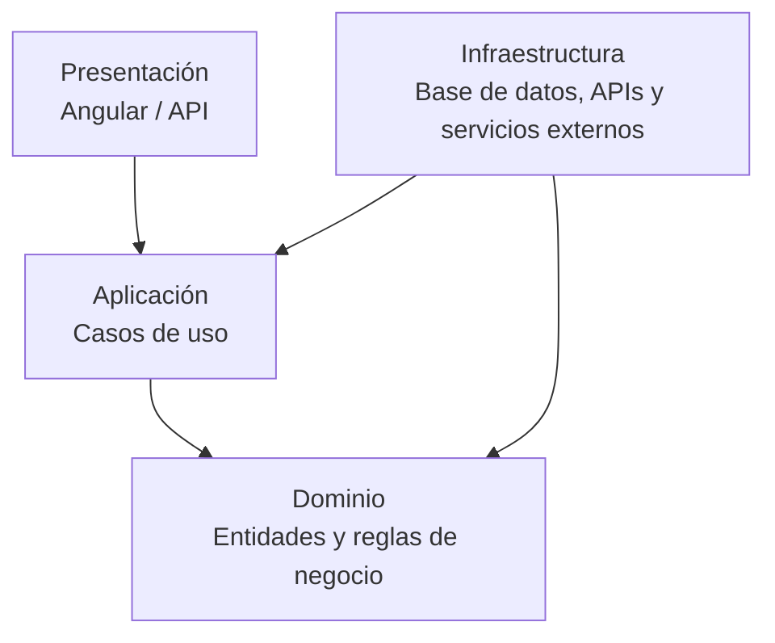

# Enfoque arquitectónico

El proyecto utilizará **Clean Architecture (Arquitectura Limpia)** como enfoque arquitectónico para organizar las dependencias internas del sistema.

## Descripción

| Elemento | Descripción aplicada al Marketplace |
|---|---|
| Patrón / enfoque arquitectónico | Clean Architecture (Arquitectura Limpia). |
| Objetivo | Separar responsabilidades y controlar las dependencias hacia el dominio. |
| ¿Qué problema resuelve? | Evita el acoplamiento entre la interfaz Angular, las reglas del negocio y las tecnologías externas, como bases de datos, APIs y servicios de pago. |
| Capas definidas | Presentación, Aplicación, Dominio e Infraestructura. |
| Beneficios | Facilita el mantenimiento y las pruebas unitarias; permite cambiar implementaciones técnicas sin modificar innecesariamente las reglas del negocio; mejora la organización y separación de responsabilidades del código. |

## Capas de Clean Architecture

- **Presentación:** contiene la interfaz de usuario y los puntos de entrada al sistema.
- **Aplicación:** contiene los casos de uso y coordina las operaciones del sistema.
- **Dominio:** contiene las entidades y reglas principales del negocio.
- **Infraestructura:** contiene las implementaciones técnicas, persistencia, APIs externas y servicios de terceros.

## Regla de dependencias

Las dependencias deben orientarse hacia las capas internas.

La capa de Dominio no debe depender de tecnologías externas, frameworks, bases de datos ni interfaces de usuario.

## Diagrama

## Beneficios para el Marketplace

- Reduce el acoplamiento entre componentes.
- Facilita las pruebas unitarias.
- Permite sustituir tecnologías externas con menor impacto.
- Protege las reglas de negocio frente a cambios tecnológicos.
- Mejora la mantenibilidad y evolución modular del sistema.